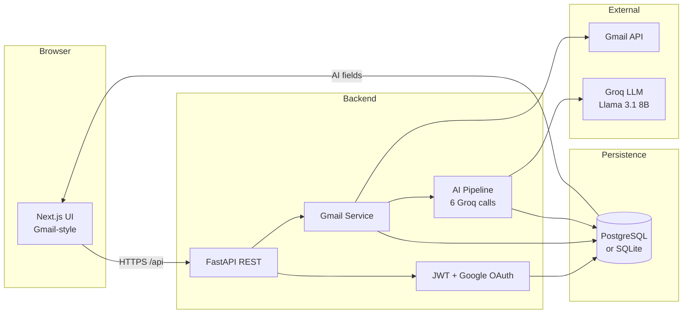
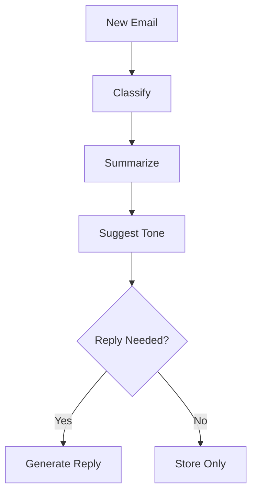

# 📬 InboxIQ  
### *Your inbox, finally intelligent.*

**An AI-powered email co-pilot that classifies, summarizes, and drafts context-aware replies — in your own voice.**

---

## 🧠 Overview

InboxIQ is an AI-powered email assistant built on top of the Gmail API.

It automatically:
- Classifies emails  
- Generates summaries  
- Suggests tone  
- Drafts replies in your writing style  

💡 Unique feature:  
A **relay memory system** that remembers instructions like  
"If X contacts you, tell them Y" — and applies them automatically later.

---

## 🔥 The Problem

- 100+ emails/day overload  
- Time wasted writing replies  
- Important emails missed  
- Existing tools only filter, not understand  

---

## ✅ Our Solution

A **6-step AI pipeline** processes every email:

1. Detect briefing context  
2. Classify email  
3. Summarize content  
4. Suggest tone  
5. Decide if reply is needed  
6. Generate reply draft  

---

## ✨ Key Features

### 🧠 Context Memory
Stores and reuses important instructions across emails.

### ⚡ One-Click Reply
Instant reply with pre-filled content.

### 🎨 Personalized Tone
Replies mimic your past writing style.

### 🔍 Smart Search Ready
Designed for future semantic search.

---

## 🏗️ System Architecture




---

## 🤖 AI Pipeline



---

## 🛠️ Tech Stack

| Layer | Technologies |
|-------|-------------|
| **Frontend** | Next.js 15, React 18, Tailwind CSS, Framer Motion, Lucide React, Axios |
| **Backend** | Python 3, FastAPI, Uvicorn, Pydantic / pydantic-settings |
| **Database** | SQLAlchemy 2 (async), PostgreSQL via asyncpg *(SQLite fallback if no `DATABASE_URL`)* |
| **Auth** | JWT (access + refresh tokens), bcrypt, Google OAuth via Authlib |
| **Email** | Gmail API via `google-api-python-client`, OAuth tokens stored per user in DB |
| **AI** | Groq API — Llama 3.1 8B Instant — classification, summarization, tone, briefing extraction, relay matching, reply generation |

---

## 📁 Project Structure

```
project/
├── frontend/
├── backend/
```

---

## 🚀 Getting Started

### Clone
```
git clone https://github.com/Vaishvik-Jaiswal/HackByte4.0.git
cd HackByte4.0
```

### Backend
```
cd backend
pip install -r requirements.txt
uvicorn main:app --reload
```

### Frontend
```
cd frontend
npm install
npm run dev
```

---

## 🔐 Environment Variables

### Backend
```
DATABASE_URL=
SECRET_KEY=
GOOGLE_CLIENT_ID=
GOOGLE_CLIENT_SECRET=
GROQ_API_KEY=
```

### Frontend
```
NEXT_PUBLIC_API_URL=http://localhost:8000
```

---

## 📡 API

| Method | Endpoint | Description |
|--------|----------|-------------|
| POST | /gmail/sync | Sync emails |
| GET | /gmail/messages | Get emails |
| POST | /gmail/send | Send email |

---

## 🌐 Links

- 🔗 GitHub Repository:  
  https://github.com/Vaishvik-Jaiswal/HackByte4.0/tree/prod

- 📊 Project Presentation (PPT):  
  https://docs.google.com/presentation/d/18lJYetW-4oh-NMpRlihXJ_qCozKsbrekz_xGp5QSZIQ/edit?usp=sharing

---

## ❤️ Final Note

InboxIQ is built to solve one simple problem:

**Emails shouldn’t take your time — AI should handle them for you.**
